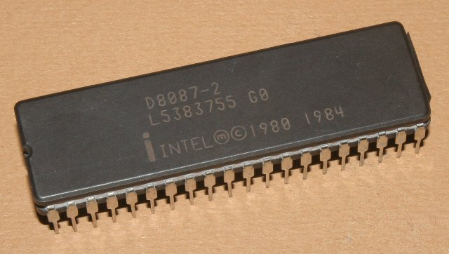

<style>
img[alt~="center"] {
  display: block;
  margin: 0 auto;
}
.columns {
  display: grid;
  grid-template-columns: repeat(2, minmax(0, 1fr));
  gap: 1rem;
}
</style>

# АКОС: вводная лекция

---

# Про меня
* Андреев Александр Николаевич
* СУНЦ / ВШЭ / МФТИ
* Работаю в Joom, ex-Яндекс.Поиск
* Мне всегда можно написать в Telegram: @carzil
* Вопросы по курсу лучше писать в общий чат!

---

# Организационная часть
<div class="columns">
<div>

* Лекции + семинары
* Оценка складывается по количеству решённых задач
* Шкала перевода будет опубликована ближе к концу семестра
* Если вы хотите получить отл, то нужно сдать устный коллоквиум

</div>
<div>


</div>
</div>


---
# Организационная часть: контесты
* Почти на каждую лекцию, 3-4 задачи
* Следите за каналом – там появится информация как зарегистрироваться в проверяющей системе
* В конце семестра запускается **антиплагиат**
* Обязательного code review нет, однако семинаристы и асситенты имеют право обнулить любую попытку :)
* Дедлайны: мягкий (-50%) и жёсткий (-100%), ~2 недели на каждый

---

# Организационная часть: защита задач
* Защита по *каждому контесту*
* 2-4 вопроса по любым сданным задачам
* Защиты будут организовываться семинаристами и/или ассистентами

---

# Про курс
* Две части: базовая и углублённая
* Вторая часть будет во втором семестре курсом по выбору
* На базовой части будем изучать как взаимодействовать с ОС
* В углубленной часть – как ОС устроены изнутри

---

# Из каких компонент состоит компьютер?

---


---


---


---



---


---


---


---

# Из каких компонент состоит компьютер?
* Центральный процессор (CPU или ЦП)
* Чипсет и материнская плата
* Оперативная память (Random Access Memory = RAM)
* Накопители (HDD, SSD, NVMe)
* Аудиокарты
* Сетевая карты
* GPU
* Шины (PCI, I2C, ISA)
* Таймеры
* USB хабы
* ...

---

# Процессор
* Исполняет _команды_ или _инструкции_
* _Регистры_ – самая быстрые доступные ячейки памяти
* Размер регистров определяют _раздрядность процессора_

---

# Оперативная память
* Random Access Memory
* Адресное пространство – непрерывный массив байт от 0 до $2^N$, где N – разрядность процессора (64 бита)
* В реальности процессоры на текущий момент обычно адресуют не более 48 бит (256 террабайт)
* Виртуальная память и физическая – два разных адресных пространства
* ОС может управлять виртуальной памятью

---

# Процессор и периферия
* Процессор общается с оперативной памятью и устройствами по специальным *шинам*
* Шины – не просто провода, это сложные системы + спецификации
* Обычно устройства выглядят как специальные адреса в памяти
* Например, HPET (High Precision Event Timer) обычно управляется по физическому адресу `0xfed00000`
* Более подробно – во второй части курса

---

# Немного ассемблера

<div class="columns">
<div>

* Мнемоника – текстовое представление инструкции
* Опкоды – машинно-читаемый код инструкции
* Инструкции процессора расположены также в RAM – архитектура Фон-Неймана

</div>
<div>

```x86asm
mov rax, qword ptr [rax]
add rax, 2
mov rbx, 1
add rax, rbx
```

<div>
</div>

---

# Что такое операционная система?

---
# Что такое операционная система?
ОС — это абстракция, которая связывает различные компоненты компьютера и пользовательские программы

---

# Зачем нужна ОС?
* Абстракция периферии
* Работа с пользовательскими процессами (планирование и изоляция)
* Управление памятью

---

# Системные вызовы
* Системные вызовы – это интерфейс операционной системы для процессов
* ABI = application binary interface
* System V ABI

---

# POSIX
* Portable Operating System Interface
* Стандарт, описывающий интерфейс операционных систем
* Системные вызовы – часть POSIX, но не всё
* Например, POSIX описывает как должна быть устроена файловая система

---

# libc

<div class="columns">
<div>

* Стандартная библиотека C
* Реализует системные вызовы в виде функций C
* Ещё куча всяких полезных функций :)
* Много реализаций, glibc одна из самых больших

</div>
<div>

* `unistd.h` (`read`, `write`, ...)
* `string.h` (`memset`, `strerror`, ...)
* `stdio.h` (`printf`, `scanf`, ...)
* `fcntl.h` (`open`, `O_RDONLY`, ...)

</div>

---

# Пример системного вызова: `read`

```c

#include <unistd.h>

ssize_t read(int fd, void* buf, size_t count);
```

## Описание

Читает из файла `fd` в память по адресу `buf` не более `count` байт и возвращает сколько байт было прочитано на самом деле.

---

# Файловые дескрипторы
* «Everything is a file!»
* Каждый файл имеет своё имя (или *путь*)
* Преобразовывать имя файла на каждый сисколл дорого
* Сначала нужно получить файловый дескриптор (например, через сисколл `open`)
* Все остальные операции без использования пути

---

```c
int main() {
    int fd = open("a.txt", O_RDONLY);
    if (fd < 0) {
        // Обработка ошибки
        char* err = strerror(errno);
        // ...
        return 1;
    }

    char* buf = malloc(1025);
    if (buf == NULL) {
        // ...
    }
    ssize_t res = read(fd, buf, 1024);
    if (res < 0) {
        // ...
    }

    buf[res] = '\0';
    printf("Read %ld byte(s) from file:\n%s", res, buf);
    return 0;
}
```

---

# `errno`

* errno – глобальная* переменная, которая хранит самую последнюю ошибку
* `errno.h`
* `EACCES`, `ENOENT`, `EINVAL`, `EBADF`, etc
* errno – не часть ОС, а часть libc

---

# Спасибо!
