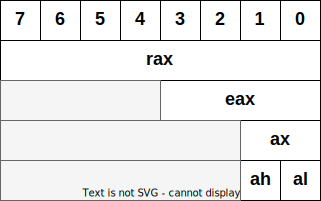
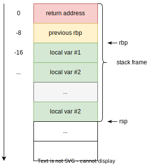

<style>
img[alt~="center"] {
  display: block;
  margin: 0 auto;
}
img[alt$=">"] {
  float: right;
  clear: none;
}
.columns {
  display: grid;
  grid-template-columns: repeat(2, minmax(0, 1fr));
  gap: 0.5rem;
}
</style>

# Ассемблер x86

---

# Intel x86
* Одна из самых распространённых архитектур процессоров
* Мы будем изучать x86-64 (2003 г.)
* AMD64 – другая архитектура (2001 г.), но почти одинаковая с x86-64
* x64, x86_64, AMD64, Intel 64 – синонимы


---

# Машинный код

* Инструкции выполняются процессором
* Опкоды (opcodes) – кодировка инструкций
* Мнемоники – человекопонятная расшифровка опкодов
* Платформозависимый!

---

# Регистры

* Очень быстрые ячейки памяти на самом процессоре
* По 64 бита на x86-64
* Числа в two-complement little endian
* Регистры общего назначения (general purpose registers): `rax`, `rbx`, `rcx`, `rdx`, `rsi`, `rdi`, `r8-r15`
* GPR со специальным значением: `rbp`, `rsp`
* «Виртуальные» регистры: `rip`, `rflags`, ...

---

# Вложенность регистров

<div class="columns">
<div>

* Некоторые регистры вложены друг в друга: например, `eax` – нижние 32 бита `rax`
* Запись в `eax` приведёт к обнулению верхних бит `rax`
* Запись в `ax` не перезапишет верхние биты `eax`
* Запись в `ah`/`al` не перезапишет верхние биты `ax`


</div>
<div>



</div>
</div>


---

# Какие ещё бывают регистры?
* Управляющие: `cr0`, ..., `cr3`
* Отладочные `dr0`, ..., `dr4`
* Сегментные: `cs`, `ds`, `ss`, `es`, `fs`, `gs`
* Model-specific: не имеют отдельных обозначений, `wrmsr`/`rdmsr`
* FPU x87: `st(0)`, ..., `st(7)`
* SSE: `xmm0`, ..., `xmm7`

---

# Как читать документацию x86 ассемблера?
<div class="columns">
<div>

Типы операндов команд:
* `imm8/16/32/64` — константы (располагаются непосредственно в опкоде)
* `r8/16/32/64` — регистры соотв. битности
* `m8/16/32/64` — операнд в памяти

</div>
<div>

```x86asm
mov r/m8,  r8    ; Move r8 to r/m8.
mov r/m16, r16   ; Move r16 to r/m16.
...
mov r/m32, imm32 ; Move imm32 to r/m32.
```

</div>
</div>

---
# Intel vs AT&T

### Intel

```x86asm
mov rax, qword ptr [rax, 2 * rcx + 0x10]
```

### AT&T
```x86asm
movq 0x10(%rax, %rcx, 2), %rax
```

---
# Адресация памяти

```x86asm
mov ...,  [base, index * 1/2/4/8 + offset]
```
* `base` и `index` – всегда регистры
* `offset` – всегда константное число

```x86asm
mov r8,  [rbp]                 ; r8 = *rbp
mov rcx, [rbx + rdi]            ; rcx = *(rbx + rdi)
mov rax, [rax + rcx * 2 + 0x10] ; rax = *(rax + rcx * 2 + 0x10)
```

---

# Адресация памяти

```x86asm
mov [rax], 0x1
```

* `rax` ссылается на 64-битное число?
* Сколько байт запишет эта инструкция?


---

# Адресация памяти

```x86asm
mov dword ptr [rax], 0x1
```
* Можно напрямую указать размера операнда памяти
* `byte`/`word`/`dword`/`qword`

---

# Какие бывают инструкции?
* «Вычислительные»
* Управляющие

---

# «Вычислительные» инструкции

```x86asm
add rax, 1   ; rax += 1
sub rax, rbx ; rax -= rbx
mul 3        ; rdx:rax = rax * 3
div r8       ; rax = rax / r8, rdx = rax % r8
xor rcx, rcx ; rcx ^= rcx
inc r9       ; r9++
```

---

# [https://www.felixcloutier.com/x86/](https://www.felixcloutier.com/x86/)

---

# Флаги

* Регистр `EFLAGS`/`RFLAGS` содержит специальные биты (флаги) результата операции
* Основные флаги:
  * `ZF`: в результате операции получился `0`
  * `SF`: результат отрицательный
  * `OF`: знаковое переполнение
  * `CF`: беззнаковое переполнение

---

# Флаги

* `0x0001 - 0x0001 = 0x0000` (выставится `ZF`)
* `0x0000 - 0x0001 = 0x1111` (выставится `SF`)
* `0x1111 + 0x0001 = 0x0000` (выставится `CF`)
* `0x0111 (7) + 0x0001 (1) = 0x1000 (-8)` (выставится `OF`)

---
# Вычисление флагов

* Есть инструкции для вычисления флагов без изменения регистров общего назначения
* `cmp` = `sub`, который только вычисляет флаги
* `test` = `and`, который только вычисляет флаги

---

# Прыжки

* Прыжки (обычно) выполняются по _метками_ в коде
* `j** label_name` перейти на метку
* `jmp` безусловный переход
* `jz` перейти, если выставлен `ZF`
* Для знакомых чисел `jl`, `jle` и т. д.
* Для беззнаковых чисел `jb`, `jbe` и т. д.

---

# Пример: бесконечный цикл

<div class="columns">
<div>

```x86asm
loop:
    jmp loop
```

</div>
<div>

```c
while (true) {
}
```

</div>
</div>

---

# Пример: аналог for

<div class="columns">
<div>

```x86asm
    mov rax, 0
    mov rcx, 0
loop:
    add rax, rcx
    add rcx, 1
    cmp rcx, 100
    jnz loop
```

</div>
<div>

```c
int rax = 0;
for (int rcx = 0; rcx < 100; rcx++) {
    rax += rcx;
}
```

</div>
</div>

---

# Пример: if

<div class="columns">
<div>

```x86asm
    test rax, rax
    jz   next
    mov  rcx, 0xdeadbeef
next:
    ...
```

```x86asm
    test rax, rax
    jnz  body
next:
    ...

body:
    mov  rcx, 0xdeadbeef
    jmp  next
```

</div>
<div>

```c
if (rax != 0) {
    rcx = 0xdeadbeef
}
```

</div>
</div>

---

# Пример: if с &&

<div class="columns">
<div>

```x86asm
    test rax, rax
    jz   else
    cmp  dword ptr [rax], 1337
    jg   else
    mov  rcx, 0xdeadbeef
    jmp  next
else:
    xor  rcx, rcx
next:
    ...
```

</div>
<div>

```c
if (rax != 0 && *(uint32_t)rax <= 1337) {
    rcx = 0xdeadbeef
} else {
    rcx = 0
}
```

</div>
</div>

---

# Пример: цикл с условием внутри

<div class="columns">
<div>

```x86asm
    mov rax, 0
    mov rdx, 0
    mov rcx, 0
loop:
    test rcx, 1
    jnz odd
    add rax, rcx
    jmp next
odd:
    add rdx, rcx
next:
    add rcx, 1
    cmp rcx, 100
    jnz loop
```

</div>
<div>

```c
int rax = 0;
int rdx = 0;
for (int rcx = 0; rcx < 100; rcx++) {
    if (rcx % 2 == 0) {
        rax += rcx;
    } else {
        rdx += rcx;
    }
}
```

</div>
</div>

---

# Стек
<div class="columns">
<div>

* Стек – просто область памяти
* Стек растёт вниз!
* На текущую вершину (первый свободный байт) указывает `rsp` (stack pointer)

</div>
<div>



</div>
</div>

---

# Стек: `push` и `pop`

<div class="columns">
<div>

```x86asm
push 1337

; или

sub rsp, 8
mov [rsp], 1337
```


</div>
<div>

```x86asm
pop rax

; или

mov rax, qword ptr [rsp]
add rsp, 8
```

</div>
</div>


---

# Функции: `call` и `ret`
<div class="columns">
<div>

* Стек позволяет реализовывать функции
* `call` вызывает функцию – кладёт адрес следующей инструкции на стек и прыгает по метке
* `ret` возвращается из функции – достаёт адрес возврата со стека

</div>
<div>

```x86asm
call func
test rax, rax
    ; ...

func:
    ; ...
```

</div>
</div>

---

# Функции: фрейм стека, пролог и эпилог

<div class="columns">
<div>

* Фрейм – область стека
* Фрейм – виртуальное понятие, т.е. он не сущствует для процессора
* Каждый вызов функции создаёт новый фрейм, в котором лежит адрес возврата
* Функция сохраняет текущий `rbp` на стеке и устанавливает новый в текущую вершину стека
* Такая последовательность действий называется прологом, а обратная – эпилогом


</div>
<div>


</div>
</div>

---

# Функции: пролог и эпилог

<div class="columns">
<div>

```x86asm
; Prologue
push rbp
mov  rbp, rsp
sub  rsp, 100

...

; Epilogue
mov rsp, rbp
pop rbp
ret
```


</div>
<div>


</div>
</div>

---

# Calling conventions

* Соглашения о вызовах – правила о том, как разные программы вызывают друг друга
* System V AMD64 ABI (application binary interface)
* Описывают, например, как вызывать функции библиотеки

---

# Calling conventions
* При вызове функций вершин стека (`rsp`) должна быть выровнена по 16 байт
* Нужно сохранить значения `rax, rdi, rsi, rdx, rcx, r8, r9, r10, r11`, если они вам нужны (scratch registers)
* `rbx, rsp, rbp, r12, r13, r14, r15` нужно вернуть в неизменном виде после выхода из функции (preserved registers)

---

# Merci!
