<style>
img[alt~="center"] {
  display: block;
  margin: 0 auto;
}
img[alt$=">"] {
  float: right;
  clear: none;
}
.columns {
  display: grid;
  grid-template-columns: repeat(2, minmax(0, 1fr));
  gap: 0.5rem;
}
</style>


# SIMD

---


# SSE

* SIMD = single instruction multiple data
* SSE = streaming SIMD extensions
* Новые 128-битные регистры: `xmm0`, `xmm1`, ..., `xmm15`
* `float`/`double` аргументы передаются в `xmm0-xmm7`
* `float`/`double` возвращаются в `xmm0`

---

# Скалярные инструкции

* `sd` = `single double`
* `ss` = `single single`
* `movss` / `movsd` помещает аргумент из памяти в младшие биты `xmmN`

```x86asm
addsd xmm0, [rsp] ; xmm0 += *(double)rsp
subsd xmm0, xmm1  ; xmm0 -= xmm1
```
---

# Сравнение скаляров через EFLAGS

<div class="columns">
<div>

* `comisd` / `comiss`
* Выставляют флаги EFLAGS
* После можно использовать `j**` как обычно

</div>
<div>

```c
SF = 0
AF = 0
OF = 0
if dst < src {
    ZF, PF, CF = 0, 0, 1
} else if dst > src {
    ZF, PF, CF = 0, 0, 0
} else if dst == src {
    ZF, PF, CF = 1, 0, 0
} else {
    // Один из операндов – NaN
    ZF, PF, CF = 1, 1, 1
}
```

</div>
</div>


---

# Векторные операции
* 128 бит = 2 double или 4 float
* Процессор умеет складывать, умножать, делить, сравнивать и многое другое *сразу с несколькими числами* в одном `xmm` регистре
* `ps` = `packed single`
* `pd` = `packed double`

---

# Векторные аналоги `mov`

<div class="columns">
<div>

* Общая форма: `mov[u|a]p[s|d]`
* `movups` / `movupd` – копирование невыровненных данных
* `movaps` / `movapd` – копирование выровненных (16 байт) данных
* `pd` = packed double

</div>
<div>

```x86asm
movaps xmmN, addr / movaps addr, xmmN
movups xmmN, addr / movups addr, xmmN
movapd xmmN, addr / movapd addr, xmmN
movupd xmmN, addr / movupd addr, xmmN
```

</div>
</div>

---

# Векторные инструкции: пример

```x86asm
; float fast_sum(float* a, float* b, size_t n)
; ...
pxor xmm0, xmm0
loop:
    addps xmm0, [rsi, rcx * ...]
    addps xmm0, [rdi, rcx * ...]
    ; ...
    jmp loop
end:
    ; ...
    ret
```

Как вернуть результат в виде скаляра?

---

# `haddps` / `haddpd`

<div class="columns">
<div>

* Специальные инструкции, чтобы «схлопывать» векторные регистры
* `horizontal add`
* Если сделать `haddps xmm0, xmm1` два раза, то в нижних битах окажутся все сложенные float'ы

</div>
<div>



</div>
</div>

---

# Векторные инструкции: пример

<div class="columns">
<div>

* Что делать, если `n` не делится на 4?
* Как правильно вычислять `rcx`?
* ДЗ: реализовать быстрое скалярное произведение двух векторов

</div>
<div>

```x86asm
; float fast_sum(float* a, float* b, size_t n)
; ...
pxor xmm0, xmm0
loop:
    addps xmm0, [rsi, rcx * ...]
    addps xmm0, [rdi, rcx * ...]
    ; ...
    jmp loop
end:
    ; ...
    haddps xmm0, xmm0
    haddps xmm0, xmm0
    ret
```

</div>
</div>

---

# Векторные инструкции: `shufps`
<div class="columns">
<div>

* `shufps xmm0, xmm1, #mask`
* Выполняет перестановку элементов из исходных регистров и записывает в регистр назначения
* Перестановка задаётся одним байтом
* Инструкция полезна, когда вычисления требуют другое положение данных в регистрах, чем в памяти
* Пример – векторное произведение

</div>
<div>

```x86asm
XMM0[0] = select(XMM0, mask & 0b00000011)
XMM0[1] = select(XMM0, mask & 0b00001100)
XMM0[2] = select(XMM1, mask & 0b00110000)
XMM0[3] = select(XMM1, mask & 0b11000000)

select(XMM, idx) {
    return XMM[idx]
}
```

</div>
</div>

---

# SSE
* В x86 есть регистры больше: AVX (256 бит, `ymmN`) и AVX-512 (512 бит, `zmmN`)
* Строковые инструкции: `pcmpistrm`, `pcmpistrm`, `pcmpestri`, `pcmpestrm`
* Арифмитические и битовые операции над целыми числами: `pxor`, `paddb`, `paddd`, `paddq`, ...
* Инструкции для преобразования типов: `cvtpd2ps`, `cvtsi2ss`, ...
* Инструкции управления памятью (в том числе и кэшем): `*fence`, `prefetch*`, `cflush*`

---

# Intrinsics

Расширения компилятора, позволяющие удобно использовать векторные инструкции в коде на `C`:

```c
float* a = ...;
float* b = ...;
float* c = ...;
for (size_t i = 0; i < n; i += 8) {
    __m128 r1 = _mm_load_ps(a + i);
    __m128 r2 = _mm_load_ps(b + i);
    __m128 r3 = _mm_add_ps(r1, r2);
    _mm_store_ps(&c[i], r3);
}
```

---

# ARM

---

<div class="columns">
<div>

# CISC
* Complex Instruction Set Computer
* CISC стремится дать как можно больше «сложных» инструкций
* Меньше инструкций, $\Rightarrow$ меньше памяти
* Сложная архитектура процессора
* Высокое потребление энергии

</div>
<div>

# RISC
* Restricted Instruction Set Computer
* RISC предоставляет мало инструкций – "кирпичики"
* Инструкции выполняются быстро – зачастую не более нескольких тактов процессора
* Проще архитектура процессора
* Меньше потребление энергии

</div>
</div>

---

# RISC vs CISC

<div class="columns">
<div>

## x86

```x86asm
add [rax, rcx * 4], 8
```

</div>
<div>

## ARM

```arm
; x0 = rax
; x1 = rcx
ldr x2, [x0, x1, lsl #2]
add x2, x2, =8
str x2, [x0, x1, lsl #2]
```

</div>
</div>

---

# ARM: регистры
* `x0`, `x1`, ..., `x30`: 64-битные регистры
* `w0`, `w1`, ..., `w30`: 32-битные регистры
* `xzr`, `wzr`: – нулевые регистры
* `sp`: указатель стэка (как `rsp`)
* `pc`: instruction pointer (как `rip`)

---

# ARM: pstate
* `pstate`: регистр флагов (аналог `EFLAGS`)
  * `n (negative)`
  * `z (zero)`
  * `c (carry)`
  * `v (overflow)`

---

# ARM: conditionals
* Большинство инструкций имеют следующую форму: `op<c> dest, src1, src2`
* `<c>` – флаг, при котором эта инструкция будет выполнена
* `ldrpl x0, =8` (`n` очищен)
* `streq x0, [x1]` (`z` установлен)

---

# ARM: RMW-операции
* Read-Modify-Write операции
* Модифицирующие инструкции могут использовать **только** регистры
* `ldr`: загрузка из памяти
* `str`: сохранение в память

```arm
ldr Xt, [Xn, offset]    ; Xt = *(Xn + offset) (-256 <= offset < 16384)
ldr Xt, [Xn]            ; Xt = *Xn
ldr Xt, [Xn, Xm, LSL n] ; Xt = *(Xn + (Xm << n))
ldr Xt, [Xn, Xm]        ; Xt = *(Xn + Xm)
```

---

# ARM: инструкции ветвления
```arm
beq label ; Branch to label if equal (z = 1)
bne label ; Branch to label if not equal (z = 0)
blt label ; Branch to label if less than (n != v)
ble label ; Branch to label if less or equal (z = 1 or n != v)
bgt label ; Branch to label if greater than (z = 0 and n == v)
bge label ; Branch to label if greater or equal (n == v)
```

---

# ARM: вызов функций
* Аналогично x86 в ARM есть инструкции для вызова функций и возвращения их
* Аналог `call`: `bl` (branch with link)
* В отличии от `call`, `bl` кладёт адрес возврата не на стек, а в специальный регистр `x30`
* `ret` так и называется, но возвращается на адрес, указанный в `x30` (или любой указанный)

```arm
func:
    push x30
    bl leaf
    ; ...
    pop x30
    ret

leaf:
    ; ...
    ret
```

---

# На этом всё! Вопросы?
