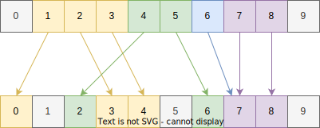
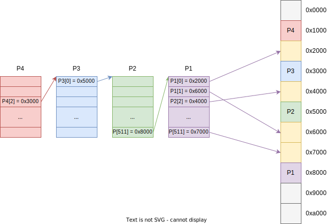
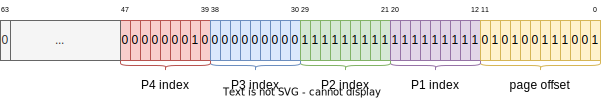
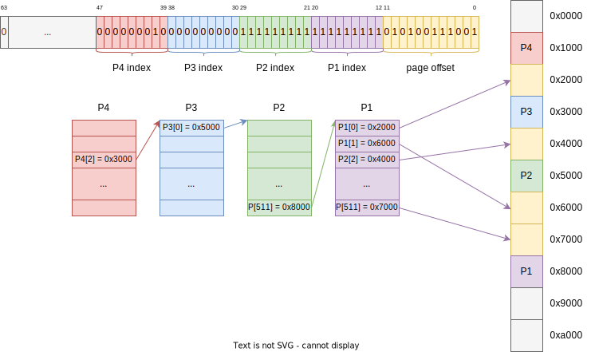

<style>
img[alt~="center"] {
  display: block;
  margin: 0 auto;
}
img[alt$=">"] {
  float: right;
  clear: none;
}
.columns {
  display: grid;
  grid-template-columns: repeat(2, minmax(0, 1fr));
  gap: 0.5rem;
}
section {
    padding-bottom: 0;
    padding-top: 0;
    padding-left: 50px;
    padding-right: 50px;
}
</style>

# Память в ОС

---

# Сегментная адресация
* Физическая память делится на куски разного размера — сегменты
* За каждым процессом закрепляются несколько сегментов: сегмент с кодом, сегмент с данными, сегмент со стеком итд
* Обращения между сегментами контролируются ОС
* Выделение памяти в худшем случае требует переноса сегмента по другому адресу – что делать с уже существующими указателями? (например, для связных списков)
* _Фрагментации памяти_


---
# Виртуальная память и страничная адресация
* Вся физическая память делится на ***фреймы*** — куски равного размера (4096 байт на x86)
* Каждому процессу выделяется своё *изолированное 64-битное адресное пространство*
* Эта *виртуальная память* делится на ***страницы*** аналогично фреймам
* Каждой странице в адресном пространстве может соответствовать какой-то фрейм

---

# Виртуальная память
* Последовательные страницы в виртуальной памяти могут быть непоследовательны в физической
* Две страницы могут траслироваться в один и тот же фрейм
* Фрейм может иметь несколько образов в разных адресных пространствах (разделяемая память)



---

# Страничная адресация
* Как хранить отображение страниц во фреймы?
* Всего существует $\frac{2^{64}}{2^{12}} = 2^{52}$ страниц памяти
* Если каждая страница описывается 8 байтами, то потребуется $2^{60}$ байт (эксабайт) памяти
* Нужен более экономный способ хранить это отображение!

---

# Hierarchical page tables
* Идея: давайте сделаем многоуровневые таблицы: сначала поделим всё пространство на части, каждую из этих частей ещё на части итд
* Не храня лишние «дыры» мы будем экономить место

---
# x86: 4-level page tables

<div class="columns">
<div>

* x86 используюет четырёхуровневые таблицы: P4, P3, P2, P1
* Каждая таблица занимает ровно 4096 байт и содержит 512 PTE (page table entry) по 8 байт
* Каждая запись ссылается на адрес следующей таблицы, последняя таблица ссылается на адрес фрейма
* Адрес текущей P4 содержит `cr3`

</div>
<div>



</div>
</div>

---

# PTE
* Адрес следующей таблицы или фрейма всегда содержит 12 нулей на конце – они используются в качестве _флагов страниц_
* Они хранят **флаги страниц**:
  * `PTE_PRESENT = 1 << 0`: должен быть установлен, если PTE существует
  * `PTE_WRITE = 1 << 1`: если установлен, то страница доступна на запись
  * `PTE_USER = 1 << 2`: доступна ли страница из юзерспейса
  * `PTE_NX = 1 << 63`: если установлен, то инструкции на странице нельзя исполнять
* Флаги имеют иерархическую видимость: если в P2 `PTE_WRITE = 0`, а в P4 — `1`, то страница будет *недоступна* на запись

---

# PTE
* Также существуют флаги, которые записывает _сам процессор_:
  * `PTE_ACCESSED = 1 << 5`: если PTE была использована при трансляции адреса
  * `PTE_DIRTY = 1 << 6`: если PTE была использована при трасляции адреса для записи
* ОС может обнулять самостоятельно эти флаги, процессор их перезапишет

---

# Виртуальные адреса
* Каждый адрес уникально задаёт последовательность PTE в разных таблицах + 12 бит смещения
* На индекс каждой PTE требуется 9 бит, $\Rightarrow$ лишь $9 \times 4 + 12 = 48$ бит используется для адресации
* Все остальные биты должны копией 47 бита – т.н. *канонический адрес*
* Обращение к кеканоническим адресам приводит к ошибке (обрабатываемой) в процессоре



---

# Виртуальные адреса



---

# TLB
* Процесс трансляции виртуального адреса в физичесий достаточно медленный
* Translation Lookaside Buffer – кэш виртуальных адресов
* TLB сбрасывается каждый раз, когда меняется адресное пространство

---

# Кэши процессора

---

# Кэши процессора: локальность данных

<div class="columns">
<div>

* **Temporal locality**: если процесс прочитал какую-то память, то скорее всего, скоро он прочитает её ещё раз
* **Spatial locality**: если процесс прочитал какую-то память, то, скорее всего, скоро он прочитает память следующую за ней

</div>
<div>

```c
int s = 0;
for (size_t i = 0; i < n; i++) {
    s += arr[i];
}
```

</div>
</div>

---

# Кэши процессора: локальность данных

<div class="columns">
<div>

* Перемножение матриц «в лоб» – плохой способ
* Обращения к `b[k][j]` происходят не локально!
* Решение: расположить матрицу `b` по столбцам (column major layout)

</div>
<div>

```c
for (size_t i = 0; i < n; i++) {
    for (size_t j = 0; j < n; j++) {
        for (size_t k = 0; k < n; k++) {
            c[i][j] += a[i][k] * b[k][j];
        }
    }
}
```

</div>
</div>

---

# Кэши процессора
* Мало данных, очень быстрый доступ
* Кэши иерархичны: L1, L2, L3
* Обычно из памяти зачитывается сразу _кэш-линия_ (64 байта)
* LRU (least recently used) для вытеснения данных

---

# Кэши процессора
* L1 кэш: per-core кэш, обычно разделён на кэш инструкций (L1i) и кэш данных (L2d), доступ: ~3 цикла, ~0.5 ns
* L2 кэш: больше по размеру, может разделяться на несколько ядер, доступ: ~12 циклов, ~4-7 ns
* L3 кэш: ещё больше по размеру (1-8 Mb), обычно один на процессор, доступ: ~40-80 циклов, ~12-20 ns
* Доступ к DRAM (если известен физический адрес): 50-100 циклов, 16+ ns

---

# Latency Numbers Every Programmer Should Know

```
L1 cache reference                           0.5 ns
Branch mispredict                            5   ns
L2 cache reference                           7   ns                      14x L1 cache
Mutex lock/unlock                           25   ns
Main memory reference                      100   ns                      20x L2 cache, 200x L1 cache
Compress 1K bytes with Snappy            3,000   ns        3 µs
Read 1 MB sequentially from memory      20,000   ns       20 µs          ~50GB/sec DDR5
Read 1 MB sequentially from NVMe       100,000   ns      100 µs          ~10GB/sec NVMe, 5x memory
Round trip within same datacenter      500,000   ns      500 µs
Read 1 MB sequentially from SSD      2,000,000   ns    2,000 µs    2 ms  ~0.5GB/sec SSD, 100x memory, 20x NVMe
Read 1 MB sequentially from HDD      6,000,000   ns    6,000 µs    6 ms  ~150MB/sec 300x memory, 60x NVMe, 3x SSD
Send 1 MB over 1 Gbps network       10,000,000   ns   10,000 µs   10 ms
Disk seek                           10,000,000   ns   10,000 µs   10 ms  20x datacenter roundtrip
Send packet CA->Netherlands->CA    150,000,000   ns  150,000 µs  150 ms
```

---

# `mmap` и `munmap`
<div class="columns">
<div>

* Системные вызовы для выделения/освобождения/изменения защиты виртуальной памяти
* `mmap` выделяет область виртуальной памяти, начиная с адреса `addr` длиной `length` байт
* `prot` определяют *флаги защиты страницы*
* `flags` определяют *как* будет страница замапплена

</div>
<div>

```c
#include <sys/mman.h>

void* mmap(void* addr, size_t len, int prot, int flags, int fd, off_t off);
int munmap(void* addr, size_t length);
int mprotect(void* addr, size_t len, int prot);
```

</div>
</div>

---

# `mmap`: `prot`
* `PROT_EXEC` — процессы могут выполнять код на этой странице
* `PROT_READ` — страница будет доступна на чтение
* `PROT_WRITE` — страница будет доступна на запись
* `PROT_NONE` — к странице никак нельзя будет обратиться

---

# On-demand paging и minor page fault
* При `mmap` ОС не обязана выделять всю запрошенную память сразу
* Вместо Linux сохраняет у себя ещё одну структуру – `virtual memory area`, которая запоминает регионы выделений памяти
* В таблицах страниц нет выделенных адресов, поэтому процессор генерирует специальное исключение при первом обращении – *page fault*
* В терминологии Linux это называется *minor page fault*

---

# Overcommit
* Т.к. память не выделяется сразу, процессы могут выделить памяти больше, чем RAM – такая ситуация называется *overcommit*'ом
* Linux позволяет регулировать поведение overcommit: полностью его выключать, ограничивать количество выделяемой памяти или давать полную свободу процессам
* `sysctl vm.overcommit_memory` / `sysctl vm.overcommit_ratio` `vm.overcommit_kbytes`
* В Windows нет overcommit

---

# Файл подкачки
* Файл подкачки (он же swap file) – специальный файл или раздел, располагающийся на диске
* Неиспользуемые или редко используемые страницы могут быть сброшены в этот файл, чтобы освободить память для других процессов
* Теперь некоторые доступы к памяти требуют чтения с диска!
* В условиях memory pressure это может приводить к странным последствиям

---

# Отображение файлов (файловые маппинги)
* Кроме выделения памяти POSIX позволяет **отображать файлы в память**
* Для этого в `mmap` надо указать `fd` и `offset`, `flags = MAP_FILE`
* По этому адресу памяти в текущем пространстве будет лежать (изменяемая) копия файла
* Любые изменения файла будут моментально отражены в памяти и видны всем остальным процессам

---

# Major page faults
* Для файловых маппингов тоже используется аналог on-demand paging: при первом обращении генерируется page fault, ядро перехватывает исключение, читает с диска файл, копирует его в память и возвращает управление в процесс
* Такой page fault называют мажорным (major page fault)

---

# Page cache
* Механизм ядра для кэширования чтений с диска
* Page cache оперирует страницами
* Страницы с данными файла из всех процессов ссылаются на один и тот же фрейм, поэтому изменения файлов (в том числе через write) видны во всей ОС сразу
* Все записи/чтения проходят через page cache
* ОС старается как можно больше данных оставлять в page cache
* В случае нехватки памяти, страницы из page cache могут быть *вытеснены*

---

# Writeback
* `write` и запись в файловый маппинг не гарантируют, что данные были в реальности записаны на диск
* Вместо этого они помечаются как изменённые (dirty)
* ОС периодически сбрасывает dirty страницы на диск (раз в несколько десятков миллисекунд)
* Вытеснение dirty страниц требует записи на диск

---

# Cинхронизация данных

<div class="columns">
<div>

* `fsync` гарантирует, что данные были записаны на диск
* `fdatasync` сбрасывает только данные на диск (нет гарантии о записи метаданных)
* `sync` записывает все изменения на диск


</div>
<div>

```c
#include <unistd.h>

int fsync(int fd);
int fdatasync(int fd);

int sync();
```

</div>
</div>

---

# `mmap`: `MAP_SHARED` vs `MAP_PRIVATE`
* Если указан `MAP_PRIVATE`, то маппинг – приватный: изменения в маппинге _не_ видны другим процессам
* `MAP_FILE | MAP_PRIVATE` – запись в маппинг не будет изменять файл
* Если указан `MAP_SHARED`, то маппинг – _разделяемый_: изменения в маппинге видны другим процессам
* `MAP_SHARED | MAP_ANONYMOUS` страницы разделяются детьми процесса-родителя после `fork`

---

# `mmap`: другие флаги
* `MAP_FIXED`: по-умолчанию ОС не даёт гарантий, что будет выделен именно запрашиваемый адрес при `MAP_FIXED` – гарантирует или выдаст ошибку
* `MAP_POPULATE`: выделить страницы под маппинг сразу

---

# Адресное пространство процесса
* Нулевой адрес нельзя замапить (`NULL` имеет особый смысл)
* Код и данные располагаются в одном адресном пространстве
* Разделения памяти условные (для ОС всё это – просто памаять)
* Ядро всегда располагается в верхних адресах (higher-half kernel)


---

# Файлы в `procfs`
* `/proc/<pid>/maps` хранит текущие virtual memory areas
* `/proc/<pid>/status` содержит статус процесса, есть куча информации о памяти: пиковое потребление, сколько сей
* `/proc/<pid>/mem` представляет собой память процесса (её можно читать и писать)
* `/proc/<pid>/map_files` хранит список файлов, которые замапленны в процесс

---

# Go raibh maith agat!
<span style="color: #ccc; font-size: 20px">«Спасибо» на ирландском языке</span>
