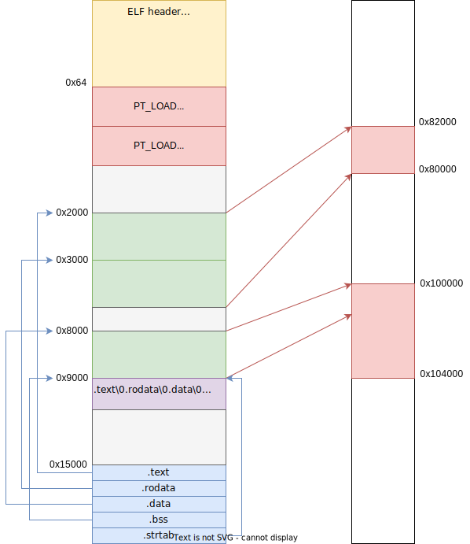

<style>
img[alt~="center"] {
  display: block;
  margin: 0 auto;
}
img[alt$=">"] {
  float: right;
  clear: none;
}
.columns {
  display: grid;
  grid-template-columns: repeat(2, minmax(0, 1fr));
  gap: 0.5rem;
}
</style>

# Процессы

---

# Что такое процесс?
«A process is an abstraction that represents an executing program. Multiple processes execute independently and have separate address spaces. Processes can create, interrupt, and terminate other processes, subject to security restrictions.»
© POSIX


---

# Аттрибуты процессора
* Сохранённый контекст процессора (регистры)
* Виртуальная память (анонимные, private/shared, файловые)
* Файловые дескрипторы
* Current working directory (cwd)
* Текущий корень (`man 2 chroot`)
* umask
* PID, PPID, TID, TGID, PGID, SID
* Resource limits
* Priority
* Capabilities
* Namespaces

---

# Состояния процессов
<div class="columns">
<div>

* `Running` – процесс готов к выполнению или уже выполняется на ядре процессора
* `Interruptible sleep` – прерываемый сон, процесс ожидает какого-то события (например, чтение из stdin)
* `Uninterruptible sleep` – непрерываемый сон
* `Stopped` – процесс остановлен и не выполняется

</div>
<div>


</div>
</div>

---
# `fork`

<div class="columns">
<div>

* Создать новый процесс можно только *скопировав* текущий с помощью `pid_t fork()`
* `fork` в родителе вернёт PID ребёнка, а в ребёнке `0`
* Ребёнок будет *полностью идентичен* родителю
* Однако файловые дескрипторы и адресное пространство будут *скопированы*
* В Linux `fork` – не системный вызов, а обёртка над `clone`

</div>
<div>

```c
#include <unistd.h>

pid_t pid = fork();
if (pid == -1) {
    // fork сломался
} else if (pid == 0) {
    // ребёнок
    // текущий pid можно получить через getpid()
} else {
    // родитель, pid содержит PID ребёнка
}
```

</div>
</div>

---

# `fork` и память процесса
* В реальность память не копируется, а используется copy-on-write
* После `fork` все страницы становятся read-only, при первой записи страница будет физически скопирована и уже новая страница будет замаплена в виртуальной памяти
* [DirtyCOW](https://dirtycow.ninja/) – уязвимость в Linux в механизме COW
* Исключение – мапинги с `MAP_SHARED` не копируются при `fork`, а остаются сами собой: то есть и родитель, и его дети оперируют физически одними и теми же страницами

---

# Семейство `exec*`

<div class="columns">
<div>

* `execve` позволяет запускать любой файл
* Он заменяет текущий процесс, процессом, созданным из указанного файла
* Файловые дескрипторы, не помеченные флагом `O_CLOEXEC`, копируются
* `exec*` всегда возвращают только ошибку

</div>
<div>

```c
#include <unistd.h>

extern char **environ;

int execl(const char *path, const char *arg0,
        ... /*, NULL */);

int execle(const char *path, const char *arg0,
        ... /*, NULL, char *const envp[]*/);

int execlp(const char *file, const char *arg0,
        ... /*, NULL */);

int execv(const char *path, char *const argv[]);

int execve(const char *path, char *const argv[],
        char *const envp[]);

int execvp(const char *file, char *const argv[]);

int fexecve(int fd, char *const argv[], char *const envp[]);
```

</div>
</div>

---

# Семейство `exec*`

<div class="columns">
<div>

* `execl*` принимает variadic arguments в качестве аргументов командной строки (argv), последний – `NULL`
* `exec*p` будет пытаться найти `file` внутри `PATH`
* `execv*` принимает указатель на массив argv

</div>
<div>

```c
#include <unistd.h>

int err = execl("/usr/bin/ls", "ls", "-la", "-h", NULL);

int err = execle(
    "/usr/bin/ls", "ls", "-la", "-h", NULL,
    "PATH=/usr/local/bin", "TERM=xterm", NULL
);

int err = int execlp("ls", "ls", "-la", "-h", NULL);

const char* argv[] = { "ls", "-la", "-h", NULL };
int err = execv("/usr/bin/ls", argv);

const char* envp[] = { "PATH=/usr/local/bin", "TERM=xterm", NULL };
int err = execve("/usr/bin/ls", argv, envp);

int err = execvp("ls", argv);

int fd = open("/usr/bin/ls", O_RDONLY);
int err = fexecve(fd, argv, envp);
```

</div>
</div>

---

# Запуск файла

```c
#include <unistd.h>

pid_t pid = fork();
if (pid == -1) {
    // fork сломался
} else if (pid == 0) {
    char* argv[] = { "ls", "-lah", NULL };
    char* envp[] = { "FOO=bar", "XYZ=abc", NULL };
    execve("/usr/bin/ls", argv, envp);
    // если оказались здесь, то что-то пошло не так во время execve
} else {
    // родитель, pid содержит PID ребёнка
}
```

---

# ELF
* Executable & Linkable Format
* Формат исполняемых файлов для Linux
* Поддерживает разные архитектуры, платформы, битности, etc
* Спецификация – часть [System V Application Binary Interface](http://refspecs.linuxbase.org/elf/x86_64-abi-0.99.pdf)
* [Структуры внутри ядра](https://github.com/torvalds/linux/blob/master/include/uapi/linux/elf.h)

---

# ELF
<div class="columns">
<div>

* Файл содержит в себе: заголовок, данные, описание секций и описание сегментов
* Секции и сегменты определяют область данных внутри ELF файла
* Секции используются во время линковки для объединения несколько ELF'ов
* Сегменты используются при исполнении, чтобы загружать данные в память процесса

</div>
<div>



</div>
</div>

---

# ELF: заголовок

<div class="columns">
<div>

* Заголовок всегда располагается в начале файла и начинается с магического числа (`7f 45 4c 46` или `\x7fELF`)
* Содержит метаданные о ELF файле
* Тип файла, битность и ссылки на таблицы с описаниями секций и сегментов, etc


</div>
<div>

```c
typedef struct elf64_hdr {
  unsigned char  e_ident[EI_NIDENT];
  Elf64_Half e_type;      // File type
  Elf64_Half e_machine;
  Elf64_Word e_version;
  Elf64_Addr e_entry;     // Entry point virtual address
  Elf64_Off e_phoff;      // Program header table file offset
  Elf64_Off e_shoff;      // Section header table file offset
  Elf64_Word e_flags;     // Processor specific flags
  Elf64_Half e_ehsize;    // Header size (bytes)
  Elf64_Half e_phentsize; // Program header size
  Elf64_Half e_phnum;     // Number of program headers
  Elf64_Half e_shentsize; // Section header size
  Elf64_Half e_shnum;     // Number of sections
  Elf64_Half e_shstrndx;  // Section header index (section name table)
} Elf64_Ehdr;
```

</div>
</div>

---

# ELF: секции

<div class="columns">
<div>

* Секции описываются таблицей секций, которая располагается в конце ELF файла
* *Таблица секций* содержит заголовок для каждой секции
* Каждая секция имеет своё имя, оно хранится не в заголовке секции, а в отдельной секции

</div>
<div>

```c
typedef struct elf64_shdr {
  Elf64_Word sh_name;       // Section name
  Elf64_Word sh_type;       // Type
  Elf64_Xword sh_flags;     // Flags
  Elf64_Addr sh_addr;       // Virtual address
  Elf64_Off sh_offset;      // Offset in ELF file
  Elf64_Xword sh_size;      // Size in bytes
  Elf64_Word sh_link;
  Elf64_Word sh_info;       // Extra information
  Elf64_Xword sh_addralign; // Alignment
  Elf64_Xword sh_entsize;   // Entry size (if table)
} Elf64_Shdr;
```

</div>
</div>

---


# ELF: стандартные названия секций
* `.data`: данные
* `.text`: исполняемый код
* `.rodata`: read-only данные
* `.symtab`: таблица символов
* `.strtab`: таблица строк
* `.shstrtab`: таблица строк с названием секций
* `.rel/.rela`: таблица релокаций

---

# ELF: `.strtab` / `.shstrtab`
<div class="columns">
<div>

* Названия секций и символов хранятся в виде null-terminated строк в специальных секциях – таблицах строк
* Если какой-то другой части ELF файла (например, заголовку секции или таблице символов) нужно сослаться на какую-то строку, то будет использовано смещение внутри соответствующей таблицы строк

</div>
<div>

```
\0.symtab\0.strtab\0.shstrtab\0.text
\0.data\0.bss\0.comment\0.note.GNU-s
tack\0.note.gnu.property\0.rela.eh
_frame\0
```

</div>
</div>

---

# ELF: `.symtab`

<div class="columns">
<div>

* `symtab` хранит таблицу символов внутри ELF-файлов
* Символ привязан к секции (`st_shndx`)
* Также каждый символ имеет *имя* и *значение*
* Значение – обычно адрес символа (оффсет относительно секции или полный виртуальный адрес)

</div>
<div>

```c
typedef struct {
    uint32_t      st_name;
    unsigned char st_info;
    unsigned char st_other;
    uint16_t      st_shndx;
    Elf64_Addr    st_value;
    uint64_t      st_size;
} Elf64_Sym;
```

</div>
</div>

---

# ELF: сегменты
<div class="columns">
<div>

* Cегмент – описание того, как ELF будет отображён в память при исполнении
* `p_vaddr`: виртуальный адрес (адрес линковки)
* `p_paddr`: адрес загрузки
* `p_filesz`: размер сегмента внутри ELF файла
* `p_memsz`: размер сегмента в памяти
* Program header array содержит все сегменты, располагается в начале файла

</div>
<div>

```c
typedef struct elf64_phdr {
  Elf64_Word p_type;
  Elf64_Word p_flags;
  Elf64_Off p_offset;   // Offset in file
  Elf64_Addr p_vaddr;   // Virtual address
  Elf64_Addr p_paddr;   // Physical (load) address
  Elf64_Xword p_filesz; // Size in file
  Elf64_Xword p_memsz;  // Size in memory
  Elf64_Xword p_align;  // Alignment
} Elf64_Phdr;
```

</div>
</div>

---

# ELF: `.bss`
<div class="columns">
<div>

* `.bss` (Block starting symbol) содержит неинициализированные данные или инициализированные нулём
* Сама `.bss` не содержится в ELF файле (зачем хранить нули?)
* Сегмент, который содержит `.bss` имеет `p_filesz < p_memsz`

</div>
<div>

```c
// arr and ptr goes to .bss
const int arr[53] = { 0 };
const void* ptr = NULL;

int main() {
    // ...
}
```

</div>
</div>

---

# Запуск образа
* `exec*` парсит первые несколько байт файла и ищет ELF magic или shebang
* Shebang: `#!/usr/bin/python3`
* Ядро создаёт образ ELF файла в памяти с помощью сегментов
* Подготавливает окружение для старта процесса (стэк, переменные окружения, etc)
* Запускает инструкцию по адресу `e_entry`
* ...
* Запускается код в `main`

---

# `exit`
* Завершает текущий процесс с определённым *кодом возврата* (exit code)
* `exit` закрывает все открытые файловые дескрипторы, освобождает выделенные страницы, etc
* Если у процесса были дети, то их родителем станет PID 1
* После этого процесс становится *зомби-процессом*
* Ядро не хранит огромную структуру для него, а только его PID и exit code

---

# `.init`, `atexit` и `.fini`
* `.init` секция хранит код, который будет выполнен при старте перед `main`
* `__attribute__((constructor))`
* `.fini` – аналогично `.init`, только выполняется после выхода из `main` или вызова `exit`
* ```__attribute__((destructor))```
* `int atexit(void (*function)(void))` позволяет динамически регистрировать функции, выполняемые при завершении работы процесса
* `exit` – функция libc
* `_exit` – это сисколл, он не выполняет `.fini` и функции, зарегистрированные в `atexit` (в том числе `fflush(stdout)`)

---

# `wait*`

<div class="columns">
<div>

* Окончательно завершает зомби-процесс или дожидается, когда процесс будет остановлен
* Для этого используются системные вызовы семейства `wait*`
* Они дожидаются завершения процесса (конкретного или любого) и возвращают специальный *exit status*
* `WNOHANG` позволяет не ждать процесс, а вернуться мгновенно

</div>
<div>

```c
#include <sys/wait.h>

pid_t wait(int *stat);

pid_t waitpid(pid_t pid, int *stat, int options);

pid_t wait3(int *stat, int options,
            struct rusage *rusage);

pid_t wait4(pid_t pid, int *stat, int opts,
            struct rusage *rusage);

```

</div>
</div>

---

# Макросы для exit code

<div class="columns">
<div>

* Обычно exit status содержит то, что передали в `exit`, но иногда процесс может завершиться не сам, а с помощью сигнала
* Для того, чтобы различать такие случаи, используются специальные макросы

</div>
<div>

```c
if (WIFEXITED(status)) {
    // процесс завершился сам
    // можно получить код возврата
    int exit_status = WEXITSTATUS(status)
}

if (WIFSIGNALED(status)) {
    // процесс был завершён сигналом
    // можно получить сигнал завершения
    int sig = WTERMSIG(status)
    if (WCOREDUMP(status)) {
        // процесс сдампил память (coredump)
    }
}
```

</div>
</div>

---

# `wait*`
* `pid < -1`: ждёт любой дочерний процесс в группе процессов `-pid`
* `pid == -1`: ждёт любой дочерний процесс
* `pid == 0`: ждёт любой дочерний процесс в текущей группе процессов
* `pid > 0`: ждёт конкретного ребёнка

---

# Группы процессов и сессии

* Процессы объединяются в *группы процессов*
* Группы процессов объединяются в *сессии*
* Применяются shell'ами для запуска нескольких джоб одновременно
* Когда шелл запускает команду, она (и её дети) запускаются в отдельной группе процессов
* `int setpgid(pid_t pid, pid_t pgid)`
* Внутри одной сессии может быть много групп процессов, но только одна foreground (остальные – background)
* Создать новую сессию: `pid_t setsid()`

---

# PID, PPID, TGID, etc
* PID = process ID
* PPID = parent process ID
* PGID = process group ID
* SID = session ID
* `pid_t getpid()`, `pid_t getppid()`
* `pid_t getpgid()`, `int setpgid(pid_t pid, pid_t pgid)`
* `pid_t setsid()`, `pid_t getsid(pid_t pid)`
* `/proc/<pid>/status` или в `/proc/<pid>/stat`

---

# Пользователи и процессы
* У каждого процесса есть набор ID пользователей (и групп), с которым он ассоциирован
* User ID, UID или real user ID — ID пользователя, который запустил процесс
* EUID (effective user ID) используется для проверок доступа
* SUID (saved user ID) – ещё один user ID, связанный с процессо
* FSUID (file system user ID) используется для проверок доступа к файлам обычно совпадает с EUID, но может быть отдельно изменён
* Есть аналогичные GID, EGID, SGID, FSGID

---

# Понижение привилегий процесса
* Представьте, что программа исполняется от root (uid = 0) и ей требуется понизить привилегии процесса (например, в нашей тестирующей системе)
* `int seteuid(uid_t)` изменяет EUID на менее привилегированный UID, однако сохраняет RUID
* `seteuid` от непривилегированного пользователя возможен обратно в EUID, RUID или SUID, но не в произвольный UID!
* `int setuid(uid_t)` также изменяет и RUID, и SUID, поэтому процесс «забывает», что он был запущен от другого пользователя и после этого можно выполнять «опасные» действия (`execve` решений)

---

# set-user-ID или «как работает sudo»?
* `chmod u+s ./exe` или `chmod("./exe", ... | S_ISUID)` ставит специальный set-user-ID бит на *файл*
* Если выполнить `exec*` на set-user-ID файле, то его EUID станет равным *владельцу файла*
* `-r-s--x--x  1 root  wheel   1.4M Aug 19 09:21 /usr/bin/sudo`

* ```c
  if (user_can_use_sudo(getuid())) {
      if (!ask_and_check_password()) {
        exit(1);
      }
      execve(command)
  }
  ```
* Для групп есть аналогичный set-group-ID бит

---

# Зачем же нужен SUID?
* На самом деле SUID также называется saved set-user-ID
* Если set-user-ID процесс вызовет `seteuid`, то он навсегда «забудет», от кого был запущен и не сможет вернуть себе изначальный EUID
* SUID всегда хранит оригинальный EUID set-user-id процесса, что позволяет временно понижать привилегии, а затем восстанавливать
* ```c
  // TUID = 1000, EUID = 1000, SUID = 1000
  execve("./set-user-id-file", ...)
  // RUID = 1000, EUID = 0, SUID = 1000
  seteuid(1000);
  // RUID = 1000, EUID = 1000, SUID = 0
  setuid(0); // невозможно без SUID!
  ```

---

# Потоки
* Внутри процессов можно запускать потоки или треды
* Отличие от процессов – треды, запущенные внутри процесса, разделяют адресное пространство процесса
* `pthreads` – библиотека для работы с тредами
* Подробнее про поток – на семинарах
* На самом деле внутри ядра нет различия между тредами и процессами – для Linux всё это описывается структурой [`task_struct`](https://elixir.bootlin.com/linux/latest/source/include/linux/sched.h#L738)
* Различие лишь в аттрибутах процесса и их наследованию при `clone`

---

# Obrigado!
