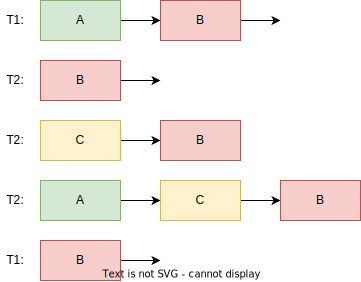
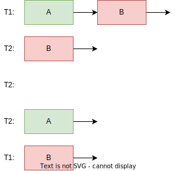

<style>
img[alt~="center"] {
  display: block;
  margin: 0 auto;
}
img[alt$=">"] {
  float: right;
  clear: none;
}
.columns {
  display: grid;
  grid-template-columns: repeat(2, minmax(0, 1fr));
  gap: 0.5rem;
}
</style>

# Синхронизация и межпроцессное взаимодействие, ч. 1

---

# Мультипроцессорные среды
* В современных процессорах много ядер
* Каждое ядро может исполнять код независимо от других
* Код не всегда исполняется последовательно (например, спекулятивное исполнение)
* Разные ядра могут по-разному видеть порядок операций

---

# Модель памяти

<div class="columns">
<div>

* Модель памяти накладывает ограничения на то, как процессор может переставлять операции местами
* Модель памяти x86 описывается в ISDM (Vol. 3A, Chapter 9)
* `std::memory_order` – другая модель памяти C++ (более общая, более сложная)
* Модели памяти не являются предметом нашего курса :(

</div>
<div>

```x86asm
x = 0, y = 0
```
<div class="columns">
<div>

```x86asm
; core 1
mov [x], 1
mov [y], 1
```

</div>
<div>

```x86asm
; core 2
mov r1, [y]
mov r2, [x]
```

</div>
</div>

Какие варианты возможны?
1. `r1 = 0` `r2 = 0`
1. `r1 = 1` `r2 = 1`
1. `r1 = 0` `r2 = 1`
1. `r1 = 1` `r2 = 0`

Модель памяти: только 4 вариант невоможен!
</div>
</div>

---


# Атомарность
* Атомарные операции – операции, которые не могут наблюдаться другими ядрами посреди исполнения
* Атомарная операция либо ещё не выполнена, либо уже выполнена
* Выровненная запись или чтение – атомарные операции
* `add [rsp], rax` – неатомарная операция, она «развернётся» в:
  ```x86asm
  mov internal_reg, [rsp]
  add internal_reg, rax
  mov [rsp], internal_reg
  ```
* Read-modify-write
* Неатомарные операции требуют _синхронизации_

---

# Процессы > ядра
* В современных ОС (runnable) процессов бывает значительно больше, чем ядер
* Процессы образуют _очередь на выполнение_
* Какой процесс будет выполнен следующим из очереди – решает _планировщик_ (scheduler)

---

# Многозадачность

<div class="columns">
<div>

## Кооперативная
* Процессы добровольно передают друг другу управление
* Если один из процессов зависнет – все остальные процессы будут бесконечно ждать его

</div>
<div>

## Вытесняющая
* Операционная система сама вытесняет процессы раз в несколько миллисекунд
* Процессы также могут самостоятельно отдавать управление
* Выделяемый квант времени может варьироваться
* Прерывание рабочего процесса – затратная операция

</div>
</div>

---

# Переключение контекста
* Процесс переключающий процесс на текущем ядре называется _переключением контекста_ (или _context switch_)
* Это операцию делает код внутри ядра
* Context switch довольно затратен, но необходим для многозадачности
* Современные процессоры могут эффективно выполнять сотни CS на одном ядре в секунду

---

# Пример: снятие денег с банковского счёта

```c
void withdraw(bank_acc_t* acc, int amount) {
    if (acc->balance < amount) {
        return;
    }
    acc->balance -= amount;
    // ...
}

int main() {
    acc->balance = 100;

    thread1 { withdraw(acc, 80); }

    thread2 { withdraw(acc, 90); }

    // acc->balance == 20 или acc->balance == 10?
}
```

---

# Race condition и data race
* Race condition – ситуация, когда результат её выполнения зависит от последовательности выполнения потоков и операций в них
* Data race – ситуация, когда два потока пишут что-то в память, не используя никакую синхронизацию

---

# Compare-and-exchange

<div class="columns">
<div>

* Compare-and-exchange (compare-and-swap, CAS) – атомарная операция в процессоре
* `cmpxchg` в x86
* `ldrex`/`strex` в ARM

</div>
<div>

```c
_Bool atomic_cas(A* obj, C* expected, C desired) {
    // Псевдокод!
    atomic {
        if (*obj == *expected) {
            *obj = desired;
            return true
        }
        *expected = *obj;
        return false;
    }
}
```

</div>
</div>


---

# Spinlock

```c
typedef atomic_int spinlock_t;

void spin_lock(spinlock_t* lock) {
    while (true) {
        int expected = 0;
        if (atomic_cas(lock, &expected, 1)) {
            break;
        }
    }
}

void spin_unlock(spinlock_t* lock) {
    atomic_store(lock, 0);
}
```

---

# Исправленный пример

```c
void withdraw(bank_acc_t* acc, int amount) {
    spin_lock(&acc->lock);

    int b = acc->balance;
    b += amount;
    acc->balance = b;

    spin_unlock(&acc->lock);
    // ...
}

int main() {
    acc->balance = 100;

    thread1 { withdraw(acc, 80); }
    thread2 { withdraw(acc, 90); }

    // acc->balance == 20 или acc->balance == 10
}
```

---

# Спинлоки: проблемы
* Процессы потребляют CPU во время ожидания

---

# Спинлоки: проблемы

<div class="columns">
<div>

* Процессы потребляют CPU во время ожидания
* Инверсия приоритетов (приводит к deadlock)

</div>
<div>

```c
void withdraw(bank_acc_t* acc, int amount) {
    spin_lock(&acc->lock);

    int b = acc->balance;
    b += amount;
    acc->balance = b;

    spin_unlock(&acc->lock);
    // ...
}

int main() {
    acc->balance = 100;

    thread1 { withdraw(acc, 80); }
    on_signal { withdraw(acc, 90); }
}
```

</div>
</div>


---

# Спинлоки: проблемы
<div class="columns">
<div>

* Процессы потребляют CPU во время ожидания
* Инверсия приоритетов (приводит к deadlock)
* Если локи берутся в разном порядке, то тоже может возникать deadlock ([dining philosophers problem](https://en.wikipedia.org/wiki/Dining_philosophers_problem))

</div>
<div>

```c
void transfer(bank_acc_t* a, bank_acc_t* b, int amount) {
    spin_lock(&a->lock);
    spin_lock(&b->lock);

    a->balance -= amount;
    b->balance += amount;

    spin_unlock(&b->lock);
    spin_unlock(&a->lock);
}

int main() {
    thread1 { transfer(x, y, 1000) }
    thread2 { transfer(y, x, 1000) }

    // ???
}
```

</div>
</div>

---

# Mutex
<div class="columns">
<div>

* Mutex = mutual exclusion
* «Засыпающий спинлок»: вместо бесконечного цикла – переводит процесс в состояние сна
* При разблокировке – отпустить лок и разбудить все ждущие процессы
* `man 7 futex`

</div>
<div>

```c
#include <pthread.h>

int pthread_mutex_lock(pthread_mutex_t* mutex);
int pthread_mutex_unlock(pthread_mutex_t* mutex);
```

</div>
</div>

---

# `pthread_mutex`: optimistic locking
* Если мьютекс занят, то с большой вероятностью он довольно скоро освободится
* Переход в контекст ядра – дорого
* Поэтому mutex проворачивает несколько сотен итераций и только потом засыпает по-настоящему

---

# Read-write lock
<div class="columns">
<div>

* Обычный мьютекс позволяет изменять структуру только одному потоку, но и _читать_ можно только одному потоку
* Разделим взятия лока на чтения, и на записи
* Сколько угодно чтений может быть параллельно, запись не может пересекаться с чтением или другой записью
* Вуаля, читатели не блокируют друг друга!

</div>
<div>

```c
#include <pthread.h>

int pthread_rwlock_rdlock(pthread_rwlock_t* rwlock);
int pthread_rwlock_wrlock(pthread_rwlock_t* rwlock);
int pthread_rwlock_unlock(pthread_rwlock_t* rwlock);
```

</div>
</div>

---

# Read-write lock: writer starvation
<div class="columns">
<div>

* `rwlock` потенциально может оказаться в ситуации, когда читатели приходят и приходят, а писатель ждёт своей очереди
* Это состояние называется _writer starvation_

</div>
<div>

```c
int pthread_rwlockattr_setkind_np(
    pthread_rwlockattr_t* attr,
    int pref);

int pthread_rwlock_init(
    pthread_rwlock_t* rwlock,
    const pthread_rwlockattr_t* attr);
```

</div>
</div>

---

# Пример: очередь задач
```c
void enqueue(queue_t* q, fn_t fn) {
    pthread_mutex_lock(&q->mutex);
    queue_push(q, fn);
    pthread_mutex_unlock(&q->mutex);
}

fn_t dequeue(queue_t* q) {
    // wait until q is non-empty – ?

    pthread_mutex_lock(&q->mutex);
    fn = queue_pop(q);
    pthread_mutex_unlock(&q->mutex);
    return fn;
}

int main() {
    for (int i = 0; i < 10; i++) {
        thread {
            while (true) {
                fn = dequeue();
                fn();
            }
        }
    }
}
```

---

```c
fn_t dequeue(queue_t* q) {
    if (queue_empty(q)) {
        fall_sleep();
    }

    pthread_mutex_lock(&q->mutex);
    fn = queue_pop(q);
    pthread_mutex_unlock(&q->mutex);
    return fn;
}

void enqueue(queue_t* q, fn_t fn) {
    pthread_mutex_lock(&q->mutex);
    queue_push(q, fn);
    pthread_mutex_unlock(&q->mutex);
    wake_all_sleeping_threads();
}
```

---

# Missing wakeup problem
<div class="columns">
<div>

```c
T1: if (queue_empty(q)) { // true
T2: pthread_mutex_lock(&q->mutex);
T2: queue_push(q, fn);
T2: pthread_mutex_unlock(&q->mutex);
T2: wake_all_sleeping_threads();
T1: fall_sleep();
```

T1 навсегда заблокируется, хотя в очереди есть задачи для обработки!

</div>
<div>

```c
fn_t dequeue(queue_t* q) {
    if (queue_empty(q)) {
        fall_sleep();
    }

    pthread_mutex_lock(&q->mutex);
    fn = queue_pop(q);
    pthread_mutex_unlock(&q->mutex);
    return fn;
}

void enqueue(queue_t* q, fn_t fn) {
    pthread_mutex_lock(&q->mutex);
    queue_push(q, fn);
    pthread_mutex_unlock(&q->mutex);
    wake_all_sleeping_threads();
}
```

</div>
</div>

---

# Чиним missing wake up problem

```c
fn_t dequeue(queue_t* q) {
    pthread_mutex_lock(&q->mutex);
    if (queue_empty(q)) {
        // атомарно отпустит мьютекс и переведёт поток в сон
        sleep_until_wakeup(&q->mutex);
        // возьмёт мьютекс при выходе
    }
    fn = queue_pop(q);
    pthread_mutex_unlock(&q->mutex);
    return fn;
}

void enqueue(queue_t* q, fn_t fn) {
    pthread_mutex_lock(&q->mutex);
    queue_push(q, fn);
    wake_all_sleeping_threads();
    pthread_mutex_unlock(&q->mutex);
}
```

---

# Spurious wakeup

<div class="columns">
<div>

* Два `dequeue` могут быть разбужены конкурентно, что приведёт к `queue_pop` из пустой очереди
* Сам `sleep_until_wakeup` может «ложно» (spurious) выйти
* Для починки нужно добавить `while`


</div>
<div>

```c
fn_t dequeue(queue_t* q) {
    pthread_mutex_lock(&q->mutex);
    while (queue_empty(q)) {
        sleep_until_wakeup(&q->mutex);
    }
    fn = queue_pop(q);
    pthread_mutex_unlock(&q->mutex);
    return fn;
}

void enqueue(queue_t* q, fn_t fn) {
    pthread_mutex_lock(&q->mutex);
    queue_push(q, fn);
    wake_all_sleeping_threads();
    pthread_mutex_unlock(&q->mutex);
}
```

</div>
</div>


---

# `pthread_cond_t`

<div class="columns">
<div>

```c
#include <pthread.h>

int pthread_cond_wait(pthread_cond_t* cond, pthread_mutex_t* mutex);
int pthread_cond_broadcast(pthread_cond_t* cond);
int pthread_cond_signal(pthread_cond_t* cond);
```


</div>
<div>

```c
fn_t dequeue(queue_t* q) {
    pthread_mutex_lock(&q->mutex);
    while (queue_empty(q)) {
        pthread_cond_wait(&q->condvar, &q->mutex);
    }
    fn = queue_pop(q);
    pthread_mutex_unlock(&q->mutex);
    return fn;
}

void enqueue(queue_t* q, fn_t fn) {
    pthread_mutex_lock(&q->mutex);
    queue_push(q, fn);
    pthread_mutex_unlock(&q->mutex);
    pthread_cond_broadcast(&q->cond);
}
```

</div>
</div>

---

# Mutex: минусы

<div class="columns">
<div>

* Процессы и мьютексы не «дружат» между собой
* Если потоко зависнет с залоченным мьютексом (например, major page fault), все остальные потоки его будут ждать
* Если процесс будет убит во время критической секции, все остальные процессы зависнут на взятии мьютекса

</div>
<div>

```c
void process1() {
    pthread_mutex_lock(&mut);
    // Убит ОС!
    pthread_mutex_unlock(&mut);
}

void process2() {
    pthread_mutex_lock(&mut);
    // ...
    pthread_mutex_unlock(&mut);
}
```

</div>
</div>

---

# Lock-free алгоритмы
Интуитивное определение – алгоритмы синхронизации, которые _не используют локи_

---

# Lock-free стек

<div class="columns">
<div>

* CAS используется в качестве примитива синхронизации
* Если цикл провернулся (CAS вернул false) – какой-то другой поток поменял вершину стека

```c
typedef struct {
    struct node* next;
    int x;
} node_t;

typedef struct {
    node_t* top;
} stack_t;
```


</div>
<div>

```c
void push(stack_t* st, node_t* n) {
    while (true) {
        node_t* old_top = st->top;
        n->next = old_top;
        if (atomic_cas(&st->top, &old_top, n)) {
            break;
        }
    }
}

void pop(stack_t* st, node_t* n) {
    node_t* top = st->top;
    while (top != NULL) {
        if (atomic_cas(&st->top, &top, top->next)) {
            break;
        }
    }
    // ...
}
```

</div>
</div>

---

# Lock-free: ABA problem

<div class="columns">
<div>

```c
T1: начинает pop()
T1: top = st->top; // A
T1: top_next = B
T2: pop() = A
T2: push(C)
T2: push(A)
T1: cas(&st->top, &top, top_next) // cas(A, A, B)
T1: C потерялся!
```

CAS (в нашем случае) сравнивает _адреса_, но не элементы!

</div>
<div>



</div>
</div>

---

# ABA проблема и освобождение памяти

<div class="columns">
<div>

```c
void pop(stack_t* st, node_t* n) {
    node_t* top = st->top;
    while (top != NULL) {
        if (atomic_cas(&st->top, &top, top->next)) {
            break;
        }
    }
    free(n); // <----
}
```

```c
T1: top = st->top; // A
T1: top_next = B
T2: pop() = A
T2: free(A)
T2: pop() = B
T2: free(B)
T2: push(A)
T1: cas(&st->top, &top, top_next) // cas(A, A, B)
T1: st->top == B
```

</div>
<div>



</div>
</div>

---

# ABA проблема: tagged pointers
* Нижние биты указателей (3 бита), возвращаемые `malloc`, будут нулями, т.к. память выровненная
* Эти биты можно использовать как версии указателя и тогда `cas` не пройдёт, т.к у A будет другой тэг
* Всего 3 бита = 8 значений, может быть переполнение и ABA опять вернётся :(

---

# ABA проблема: double word CAS и другие варианты
* На некоторых платформах возможно реализовать CAS, который делает обновление по двум машинным словам
* В стеке можно завести постоянно увеличивающийся счётчик
* По-сути – аналог tagged pointers, но с большим количеством тэгов
* Intermediate nodes
* Hazard pointers

---


# Минусы lock-free
* Lock-free гарантирует, что система _в целом делает прогресс_, однако допускают ситуацию, когда один поток выполняется _вечно_
* Lock-free алгоритмы сложнее, чем аналоги на блокировках (ABA проблема)
* Освобождение памяти не такое простое

---


# Þakka þér fyrir!
