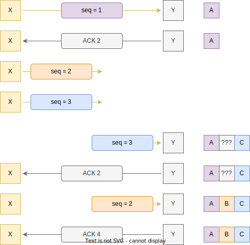

<style>
img[alt~="center"] {
  display: block;
  margin: 0 auto;
}
img[alt$=">"] {
  float: right;
  clear: none;
}
.columns {
  display: grid;
  grid-template-columns: repeat(2, minmax(0, 1fr));
  gap: 0.5rem;
}
img[alt~="mt"] {
    margin-top: 50px;
}
section {
    padding-bottom: 0;
    padding-top: 0;
    padding-left: 50px;
    padding-right: 50px;
}

</style>

# Компьютерные сети, ч. 1

---

# Протоколы

- Современные компьютерные сети строятся на основе _протоколов_
- Каждый протокол – это (обычно) абстракция над другим протоколом (более низким)
  для решения какой-то _проблемы_
- _Стек протоколов_

---

# Модель OSI

OSI разделяет современные протоколы на 7 уровней:

- Layer 1: Physical layer
- Layer 2: Data link layer
- Layer 3: Network layer
- Layer 4: Transport layer
- _(тут немного пропустим)_
- Layer 7: Application layer

---

# Physical layer

_Как данные будут переданы через физическую среду?_

Протоколы:

- Bluetooth
- Ethernet physical layer: Ethernet over twisted pair, Fast Ethernet, Gigabit
  Ethernet, ...
- IEEE 802.11g/b/n

---

# Link layer

_Как копьютеры могут общаться в локальной сети?_

- Обеспечивает обмен данными между узлами в одной сети LAN (local area network)
- Обычно на этом уровне протоколы оперируют пакетами (например, 1500 байт для
  Ether)
- На этом уровне появляется канальный адрес (link address)

---

# Ethernet

- Совокупность стандартов (IEEE 803.2), описывающих разные протоколы physical и
  link layer
- Передача между устройставми осуществляется с помощью _фреймов_ (пакетов)
- Каждое устройство имеет свой MAC адрес
- MAC адрес: `02:42:48:34:d1:d9`, `00:50:57:dc:93:fa`


---

# Link layer


---

# Link layer: Ethernet

<div class="columns">
<div>

- Обычный Ethernet порт предполагает point-to-point соединение
- Коммутаторы обеспечивают передачу данных между несколькими узлами сети
- Топология «звезда»

</div>
<div>


</div>
</div>

---

# Link layer: адресация

<div class="columns">
<div>

- Коммутаторы умеют отправлять пакеты сразу многим компьютерам в LAN
- Unicast: от одного узла к одному узлу
- Broadcast: от одного узла ко всем узлам
- Multicast: от одного узла к группе
- Ethernet не различает broadcast и multicast
- Broadcast адреса имеют особый формат – LSB в первом октете равен 1
  (`ff:ff:ff:ff:ff:ff`)

</div>
<div>


</div>
</div>

---

# Network layer

<div class="columns">
<div>

_Как объединить локальные сети?_

- Обеспечивает связь между разными LAN
- Не все LAN могут быть соединены между собой, появляется _маршрутизация_
- На этом уровне появляется _сетевой адрес_
- Internet Protocol (IP)

</div>
<div>


</div>
</div>

---

# Internet Protocol

- Протокол для объединения LAN
- Две версии: IPv4 vs IPv6
- IPv4 широко распространён, IPv6 только начинает появляться
- IPv4 адрес состоит из 32 бит (для IPv6 – 128)
- Обычно записывается в виде 4 октетов через точку: `8.8.8.8`
- IPv6 адреса записываются в виде 8 16-битных чисел через двоеточие:
  `fe80:0000:0000:0000:a4b0:d8ff:fe7a:8f97`
- Сокращённая форма: `fe80::a4b0:d8ff:fe7a:8f97`

---

# Маска подсети

- Множество IP-адресов с одинаковым _префиксом_
- Маска подсети: `255.0.0.0`
- CIDR-нотация: `10.0.0.0/8`
- Приватные подсети (не адресуются публично): `10.0.0.0/8`, `127.0.0.1/8`,
  `192.168.0.0/16`

---

# Маршрутизация в IP

- Не все LAN связаны напрямую $\Rightarrow$ давайте передавать пакеты через
  другие LAN
- Передача между соседними LAN в IP называется _прыжком_ или _хопом_ (hop)
- Каждый узел внутри LAN имеет _таблицу маршрутизации_
- Эта таблица содержит заиписи в виде: маска подсети + шлюз (_gateway_)
- Обычно такие записи называются _маршрутами_
- Default gateway – маршрут по-умолчанию

---

# Маршрутизация в IP


---

# ARP

* На какой канальный адрес отправить пакет, если мы знаем только IP адрес шлюза?
* Address Resolution Protocol (ARP) – определяет MAC адрес по IP
* В текущей LAN рассылается broadcast пакет «Who has 10.3.0.1? Tell 10.3.0.243»
* Все хосты проверяют свой IP и если он совпадает, отсылают «10.3.0.1 is at
  xx:xx:xx:xx:xx:xx»
- ARP spoofing

---

# IPv4 пакет


---

# TTL

- TTL – tive-to-live
- Байт, который описывает максимальное количество прыжков в сети
- Если очередной хост уменьшил TTL до нуля, то пакет не отправляется дальше, а
  отправителю посылается специальное сообщение по протоколу ICMP (TTL exceeded)
- На основе этого поведения работает traceroute/tracepath

---

# Проблемы IP

- Не гарантирует доставку данных (packet loss)
- Не гарантирует порядок доставки (packet reordering)
- Не гарантирует, что пакет будет отправлен лишь один раз (packet duplication)
- Непонятно как реализовывать multitenancy IP протокола – нельзя всем
  приложениям рассылать все IP-пакеты

---

# Transport layer
_Как обеспечить обмен данными между приложениями?_

- Используется для передачи данных между различными приложениями на узлах сети
- Целочисленные числа, называемые _портами_ используются, чтобы разделять
  приложения на концах маршрутов
- Примеры: TCP, UDP, SCTP

---

# TCP

- Transmission Control Protocol
- Обеспечивает надёжную доставку данных (reliable delivery)
- Обеспечивает порядок доставки и дедупликацию данных
- Connection-oriented – приложения должны установить полнодуплексное
  _соединение_
- Данные передаются в приложения не отдельными пакетами, а непрерывным _потоком_
- Однако физически (точнее, на network layer) всё ещё передаются в пакетах, которые традиционно называются _сегментами_

---

# TCP пакет


---

# Three-way handshake

Рукопожатие или хендшейк – механизм установки соединения. Выполняется в три
этапа:

1. Инициатор соединения (клиент) посылает пакет с флагом **SYN** серверу
1. Сервер посылает пакет с флагами **SYN** и **ACK** клиенту, а также _sequence
   number_, с которого будут нумероваться все остальные байты
1. Клиент посылает **ACK** (и выбирает seqno со своей стороны)

---

# TCP

<div class="columns">
<div>

- Все пакеты (в одну сторону) нумеруются, начиная с определённого числа
- На каждый полученый пакет с данными, получатель отправляет пакет с флагом
  **ACK**, в котором указывает следующее ожидаемое sequence number
- Если пакет теряется, то **ACK**'и не будут увеличиваться
- При получении трёх одинаковых **ACK**, отправитель перепосылает пакет
- Fast retransmit

</div>
<div>


</div>
</div>

---

# TCP

<div class="columns">
<div>

* Если ждать два повторяющихся **ACK**, то будет создаваться дополнительная нагрузка на сеть при переупорядочавании пакетов

* Как быть, если отправитель не послал достаточное количество пакетов для трёх одинаковых **ACK**?

</div>
<div>



</div>
</div>

---

# TCP

<div class="columns">
<div>

* С каждым отправленным пакетом ассоциируется таймер
* Если пришёл **ACK**, то отменяются таймеры для меньших номеров
* Если таймер истёк, то происходит перепосылка пакета и запускается новый таймер
* Timeout-based retransmission

</div>
<div>


</div>
</div>

---

# TCP congestion control
* Отправлять по одному пакету за раз – невыгодно, т.к. пропускная способность сети достаточно большая
* Отправитель фиксирует специально «окно» – количество байт, которое можно отправить без **ACK**
* Окно увеличивается при успешных доставках, при ретрансмисиях – уменьшается
* Обычно окно растёт экспоненциально до порога, затем – линейно; при ретрансимссиях сбрасывается

---

# MTU и MSS
* Максимальный размер Ethernet фрейма (MTU = maximum transmission unit) обычно ~1500 байт
* Заголовок IP – ~20 байт, заголовок TCP – ~20 байт, $\Rightarrow$ максимальный размер данных в TCP пакете ~1460 байт
* MSS = Maximum Segment Size
* Алгоритмы congestion control оперируют обычно в терминах MSS

---

# Flow control
- Flow control или backpressure – сопротивление принимающей стороны принимать больше трафика
- Превышение ресурсов сервера не будет вызывать бóльший наплыв сетевых пакетов, вместо этого клиенты будут ждать, пока сервер разберётся с текущей нагрузкой
- Backpressure реализован на многих уровнях в современных системах

---

# Завершение соединения
В отличие от соединения, TCP соединение может быть закрыто какой угодно стороной

1. Завершающая сторона отправляет **FIN**
2. Другая сторона отправляет **ACK** и переходит в состояние **LAST_ACK**
3. Другая сторона отправляет **FIN**
4. Завершающая сторона отправляет **ACK** и переходит в состояние **TIME_WAIT**
5. Другая сторона закрывает соединение
5. Через некоторое время соединение окончательно закрывается на завершающей стороне

---

# `TIME_WAIT`

* Состояние **TIME_WAIT** требуется, если последний **ACK** был потерян
* Если это произойдёт, другая сторона будет ждать в состоянии **LAST_ACK**
* Новые соединения не смогут быть установлены (для 4-tuple)
* На **SYN** другая сторона будет всегда отправлять **RST**

---

# TCP

- Иногда потеря пакетов не играет особой роли (VoIP)
- Иногда и переупорядочивание не играет особой роли (торренты, онлайн игры)
- TCP в таких случаях будет зависать пока старые пакеты не дойдут в правильнном
- Как быть?

---

# UDP

<div class="columns">
<div>

* User Datagram Protocol
* Не даёт никаких гарантий
* Нет понятия «соединения»
* Чексумма пакета
* Часто UDP используют в паре с TCP
* WebRTC: signal channel + передача данных

</ul>

</div>
<div>


</div>
</div>

---

# Application layer
_Как приложения обмениваются данными?_

- Протоколы приложений (веб-браузеры, почтовые клиенты, игры)
- Один из самых известных – HyperText Transfer Protocol (HTTP)
- Почтовые протоколы – SMTP, POP3
- Secure Shell (SSH)
- Domain Name System (DNS)

---

# DNS

* Позволяет преобразовывать человекочитаемые доменные имена в IP-адреса
* Работает поверх UDP, стандартный порт – 53
* Корневые сервера обслуживают _все запросы_ DNS в интернете
* DNS – иерархичен: корневые сервера спускаются к более «узким» DNS серверам (например, к .ru)
* Более мелкие могут спускаться дальше итд – recursive resolving
* Результат кэшируется и имеет время жизни, заданное в ответе DNS (TTL)

---

# DNS: виды записей

<div class="columns">
<div>

- **A** запись: `имя -> IPv4 адрес`
- **AAAA** запись: `имя -> IPv6 адрес`
- **NS** запись: `имя -> авторитетный DNS-сервер`
- **CNAME** запись: `имя -> имя` (алиас)

</div>
<div>

```
$ dig yandex.ru

; <<>> DiG 9.10.6 <<>> yandex.ru
;; global options: +cmd
;; Got answer:
;; ->>HEADER<<- opcode: QUERY, status: NOERROR, id: 16893
;; flags: qr rd ra; QUERY: 1, ANSWER: 4, AUTHORITY: 0, ADDITIONAL: 1

;; OPT PSEUDOSECTION:
; EDNS: version: 0, flags:; udp: 4096
;; QUESTION SECTION:
;yandex.ru.			IN	A

;; ANSWER SECTION:
yandex.ru.		218	IN	A	5.255.255.77
yandex.ru.		218	IN	A	77.88.55.60
yandex.ru.		218	IN	A	77.88.55.88
yandex.ru.		218	IN	A	5.255.255.70

;; Query time: 54 msec
;; SERVER: 10.110.0.17#53(10.110.0.17)
;; WHEN: Thu Nov 02 02:43:31 MSK 2023
;; MSG SIZE  rcvd: 138
```

</div>
</div>

---

# HTTP

- HyperText Transport Protocol
- L7 протокол
- Запрос-ответ: клиент отправляет запросы, сервер возвращает ответы
- Человеко-читаемый
- Для перевода строк служит `\r\n`

---

# HTTP запрос

<div class="columns">
<div>

- Метод: GET, POST, DELETE, PUT, OPTIONS, HEAD
- Uniform Resource Identifier (URI) – путь запроса
- Версия HTTP
- Заголовки запроса
- Тело (опционально)

</div>
<div>

```http
POST /cgi-bin/process.cgi HTTP/1.1
User-Agent: Mozilla/4.0 (compatible; MSIE5.01; Windows NT)
Host: www.example.com
Content-Type: application/x-www-form-urlencoded
Content-Length: length
Accept-Language: en-us
Accept-Encoding: gzip, deflate
Connection: Keep-Alive

licenseID=string&content=string&/paramsXML=string
```

</div>
</div>

---

# HTTP ответ

<div class="columns">
<div>

- Версия HTTP
- Код (статус) ответа
- Расшифровка ответа (reason)
- Заголовки ответа

</div>
<div>

```http
HTTP/1.1 404 Not Found
Date: Sun, 18 Oct 2012 10:36:20 GMT
Server: Apache/2.2.14 (Win32)
Content-Length: 230
Connection: Closed
Content-Type: text/html; charset=iso-8859-1
```

</div>
</div>

---

# HTTP: статус коды

- **1xx** – информационные
- **2хх** – успешные коды (например, 200 OK)
- **3xx** – для перенаправлений пользователей (редиректы)
- **4xx** – ошибка клиента (неправильный адрес, некорретный запрос)
- **5xx** – ошибка сервера (внутреняя ошибка, сервис временно недоступен)

---

# TLS/SSL
- TLS = Transport Layer Security
- Протокол, позволяющий поверх TCP соединения создать защищённый канал
- Много реализаций, самая известная – OpenSSL
- TLS сертификат (публичный ключ сервера) требуется для установки соединения
- CA = Certificate Authority
- HTTPS – HTTP, завёрнутый в SSL :)

---

# 감사합니다
<span style="color: #ccc; font-size: 20px">«Спасибо» на корейском языке</span>
